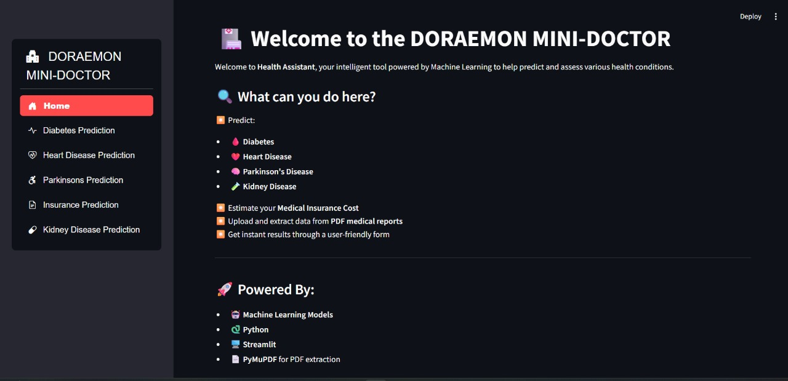
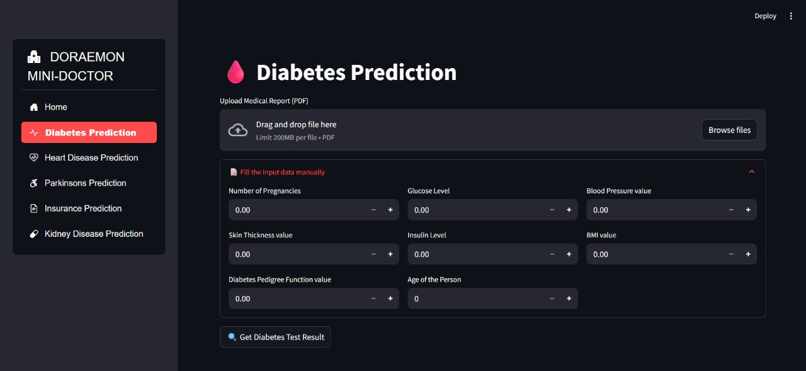
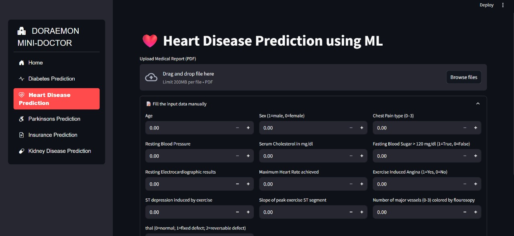
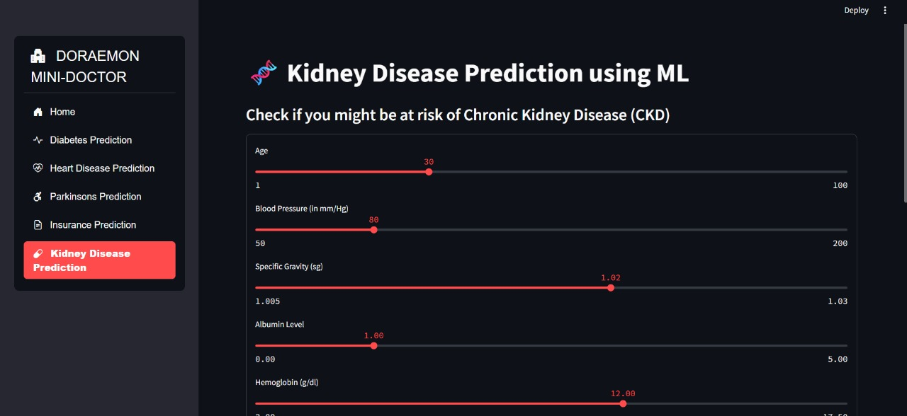
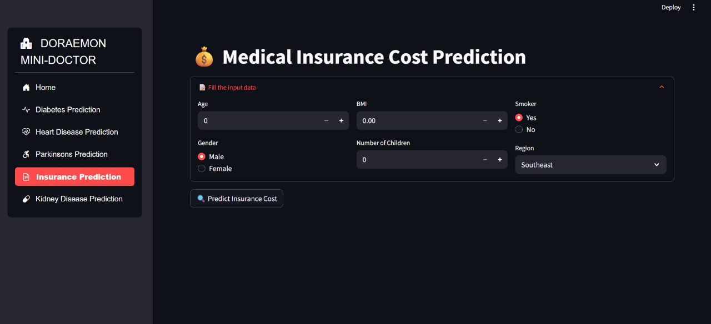

# 🩺 Mini Doctor – AI-powered Health Prediction System

  
  
  
  
  


---

## 📌 Overview

**Mini Doctor** is an **AI-powered healthcare assistant** that predicts multiple diseases and estimates medical insurance costs.  
It uses **machine learning models** trained on medical datasets to provide quick and reliable health insights.

---

## 🚀 Features

- 🫀 **Heart Disease Prediction**
- 🧠 **Parkinson’s Disease Prediction**
- 🩸 **Diabetes Prediction**
- 🩺 **Kidney Disease Prediction**
- 💰 **Insurance Cost Estimation**

---

## 🛠️ Tech Stack

- **Languages:** Python
- **Libraries:** scikit-learn, pandas, numpy, matplotlib, seaborn
- **Framework:** Streamlit / Flask
- **Models:** Classification & Regression (Logistic Regression, Random Forest, etc.)

---

## ⚡ Installation & Usage

1. Clone this repository:
   ```bash
   git clone https://github.com/Rudra3-spec/MINI_DOCTOR.git
   cd MINI_DOCTOR
   ```

Install dependencies:

2. pip install -r requirements.txt

Run the app:

3. streamlit run app.py

## 🖼️ Screenshots

| Home Page          | Disease Prediction    |
| ------------------ | --------------------- |
|  |  |

| Insurance Estimation    | Model Overview       |
| ----------------------- | -------------------- |
|  |  |

| Final Result         |
| -------------------- |
|  |

📊 Example Input / Output

Input: Age, gender, BMI, glucose level, blood pressure, medical history.

Output:

Disease risk prediction → “High risk of Diabetes”

Insurance estimate → ₹75,000 annual premium

🎯 Future Scope

Add more disease prediction models.

Integrate with IoT / wearable devices.

Develop a mobile app for real-time health tracking.

🤝 Contribution

Contributions are welcome!

Fork the repo

Create a feature branch

Commit changes and open a PR

📜 License

This project is licensed under the MIT License.
